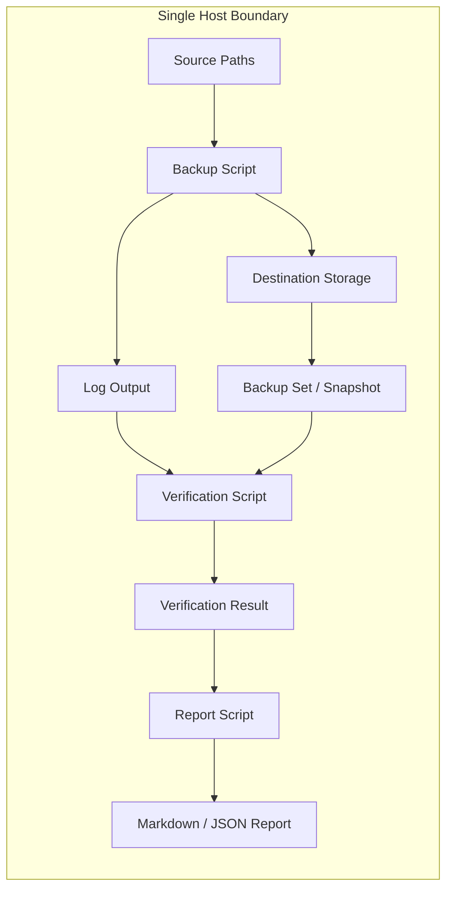

# Architecture Overview

This document explains how the components of the Local Backup and Recovery
Framework connect to each other. Read this first, before any other
documentation in this repository.

---

## Purpose of This Document

A reviewer or new operator who reads only this document should understand:

- What the framework does end to end
- How data flows from source to backup to verification to report
- Why each component exists and what it depends on
- Where to look next for deeper detail on any specific component

---

## System Boundary

This framework operates entirely within a single host's local or directly
attached storage. It does not orchestrate backups across multiple hosts, and
it does not transmit data over a network unless the destination path is a
mounted network share (UNC path on Windows, NFS/CIFS mount on Linux).

The destination storage may be a local volume, an attached external drive,
or a network share mounted at the OS level. The framework treats all of
these identically - it operates against a filesystem path, not a protocol.

---

## Component Map

### Windows side

| Component | Role |
|---|---|
| `windows/Invoke-Backup.ps1` | Executes the backup. Reads configuration, creates a dated backup set, invokes robocopy (optionally against a VSS shadow copy), generates a manifest. |
| `windows/Test-BackupIntegrity.ps1` | Verifies a completed backup set against its source paths using file count, size, and SHA256 spot-check comparisons. |
| `windows/Start-Restore.ps1` | Restores a backup set to a destination, with pre-restore validation and post-restore verification. |
| `windows/Set-RetentionPolicy.ps1` | Purges backup sets that exceed the configured retention window, subject to a minimum-sets floor. |
| `windows/New-BackupReport.ps1` | Reads log and result data produced by the other scripts and renders a structured report. |

### Linux side

| Component | Role |
|---|---|
| `linux/backup.sh` | Executes the backup using rsync with hard-link incremental snapshots. Generates a manifest. |
| `linux/verify-backup.sh` | Verifies a completed snapshot against its source paths using file count, size, and SHA256 spot-check comparisons. |
| `linux/restore.sh` | Restores a snapshot to a destination, with pre-restore validation and post-restore verification. |
| `linux/enforce-retention.sh` | Purges snapshots that exceed the configured retention window, subject to a minimum-snapshots floor. |
| `linux/generate-report.sh` | Reads log and result data produced by the other scripts and renders a structured report. |

### Shared concepts across both platforms

| Concept | Windows term | Linux term |
|---|---|---|
| A single completed backup run | Backup set | Snapshot |
| Naming convention | `{prefix}_{yyyy-MM-dd}_{HHmm}` | `{label}_{yyyy-MM-dd}_{HHmm}` |
| Integrity manifest | `backup.manifest` (SHA256, inside the backup set) | `backup.manifest` (SHA256, inside the snapshot) |
| Open-file handling | VSS shadow copy | rsync reads files as they are; no equivalent snapshot mechanism is used at the filesystem level - see `threat-model.md` for the implication |
| Space efficiency | Full copy per backup set (robocopy does not hard-link) | Hard-link incremental snapshots via `--link-dest` |

The space efficiency difference is deliberate, not an oversight. Windows
NTFS hard links work differently from Linux filesystem hard links in
robocopy's default operating model, and Volume Shadow Copy already provides
point-in-time consistency. The Linux side uses the hard-link snapshot
pattern, which is the standard native approach for space-efficient
incremental backup. This is documented further in `backup-strategy.md`.

---

## Data Flow: A Complete Backup Cycle

1. **Operator runs the backup script** (`Invoke-Backup.ps1` or `backup.sh`),
   passing a populated configuration file.

2. **The script loads and validates configuration.** Missing required
   fields or invalid paths cause an immediate, clearly logged failure
   before any data is touched.

3. **A dated backup set or snapshot directory is created** under the
   configured destination root.

4. **For each source path**, the script copies files into a corresponding
   subdirectory of the backup set, using robocopy (Windows) or rsync
   (Linux). Every action is logged as a structured JSON entry.

5. **A SHA256 manifest is generated** listing every file in the completed
   backup set with its checksum. This manifest is the foundation for all
   later integrity verification.

6. **The script writes a run summary log entry** and optionally sends a
   notification email on failure.

7. **The operator (or a scheduled task) runs the verification script**
   (`Test-BackupIntegrity.ps1` or `verify-backup.sh`) against the
   completed backup set.

8. **Verification performs three checks:** file count comparison, total
   size comparison, and a SHA256 spot-check against the manifest. Results
   are written as a structured result file.

9. **The operator runs the report script** (`New-BackupReport.ps1` or
   `generate-report.sh`), which reads the backup run log and the
   verification result file, and renders a combined report in Markdown or
   JSON.

10. **Periodically, the retention script** (`Set-RetentionPolicy.ps1` or
    `enforce-retention.sh`) purges backup sets older than the configured
    retention window, always preserving a configured minimum number of
    recent sets.

11. **Periodically - at minimum monthly - the operator runs the restore
    script** (`Start-Restore.ps1` or `restore.sh`) against a non-production
    destination to confirm that backups are actually restorable. This step
    is the one most backup processes skip, and is the reason this
    framework exists.

---

## Why the Manifest Is Central

The SHA256 manifest generated at backup time is referenced by three
different scripts: the integrity verification script, the restoration
script, and indirectly the reporting script.

This is a deliberate design choice. Generating checksums once, at backup
time, and reusing them for all subsequent verification avoids re-reading
and re-hashing the entire source dataset every time integrity needs to be
confirmed. It also means that integrity verification can run independently
of the original source paths being available - useful when restoring to a
different host than the one that produced the backup.

---

## Configuration as the Single Source of Truth

Every script reads from the same configuration file (one per platform).
There is no hidden state, no separate credential store, and no database.
This is intentional: an operator should be able to understand the entire
behavior of the framework by reading one file per platform.

The example configuration files (`config/windows-backup.example.json` and
`config/linux-backup.example.conf`) are exhaustively commented. Reading
either file end to end is equivalent to reading a specification of every
configurable behavior in the framework.

---

## Logging as the Integration Layer

Scripts do not call each other directly. There is no orchestration layer.
Instead, every script writes structured JSON log entries to a common log
directory, and downstream scripts (primarily the reporting scripts) read
those logs to assemble their output.

This loosely coupled design has an operational benefit: any script can be
run independently, at any time, without requiring the others to have run
first (with the exception of the manifest, which is generated at backup
time and consumed by verification and restoration). An operator can run
verification days after a backup completed, using only the log and
manifest data left behind.

---

## What Is Explicitly Out of Scope

This architecture does not include:

- A central database or state store
- A web interface or API
- Cross-host orchestration or fleet management
- Real-time or continuous backup (all operations are point-in-time runs)
- Encryption of backup data at rest (the operator's destination storage
  is responsible for this - see `threat-model.md`)

These boundaries are documented in full, with rationale, in
`threat-model.md` and `backup-strategy.md`.

---

## Where to Go Next

| If you want to... | Read... |
|---|---|
| Understand what this protects against and what it doesn't | `threat-model.md` |
| Understand the reasoning behind defaults and design decisions | `backup-strategy.md` |
| Set up the framework on Windows Server 2022 | `windows-setup-guide.md` |
| Set up the framework on RHEL 9 | `linux-setup-guide.md` |
| Perform an actual or test restoration | `restoration-runbook.md` |
| Understand or adjust retention behavior | `retention-policy.md` |
| Diagnose a script failure | `troubleshooting.md` |
| Look up exact script syntax | `command-reference.md` |
| Automate backup execution | `scheduling-guide.md` |

